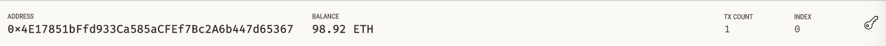
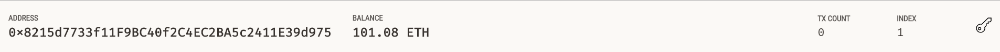
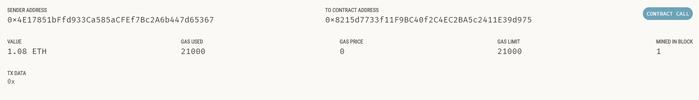

## Fintech Finder

In this case study, a payment processor was created to run on the Ethereum blockchain. It was then tested on a local blockchain.
-
The below images show the sender and recipient addresses along with the transaction details

## Dependencies
Streamlit, dataclasses, typing, Web3, pre-built crypto_wallet functions